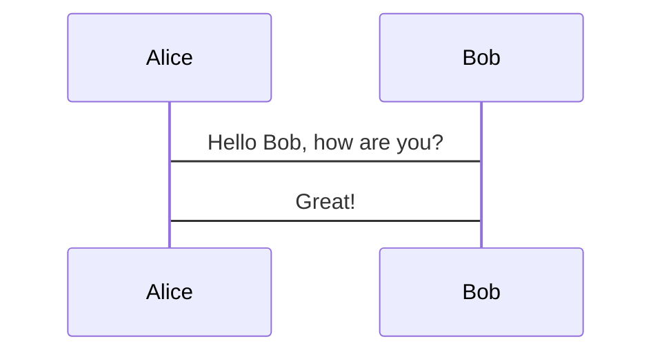

# Markdown Sample File

This file will test whether various markdown features work correctly.

In headers, you should see icons.

### Example header

if you do not see icons, or you see question marks, you need to set your terminal font to a nerd font.

## Text Formatting

*italics* _italics_ **bold** __bold__ ~~strikethrough~~

## Lists

* Unordered star
* Unordered star
* Unordered star
- Unordered dash

1. Ordered
1. Ordered
1. Ordered

- [ ] Unchecked
- [x] Checked
- [/] Inprogress
- [-] Cancelled
- [!] Error
- [?] Question


## Tables

| Column 1 | Column 2 | Column 3 |
| -------- | -------- | -------- |
| Cell 1   | Cell 2   | Cell 3   |
| Cell 4   | Cell 5   | Cell 6   |


## Images

Images should be displayed inline if all packages are properly installed and using a kitty terminal


You can also preview images with the keyboard shortcut

## Code Blocks

```
int main() {
    printf("No formatter set");
}
```

```c
int main() {
    printf("Hello World");
}
```

```bash
echo "Hello World"
```

```python
print("Hello World")
```

```rust
println!("Hello World")
```

```go
fmt.Println("Hello World")
```

```lua
print("Hello World")
```

```javascript
console.log("Hello World")
```

```html
<h1>Hello World</h1>
```

```css
h1 {
    color: red;
}
```

```json
{
    "name": "John Doe",
    "age": 30
}
```

```yaml
name: John Doe
age: 30
```

```toml
name = "John Doe"
age = 30
```

```sql
CREATE TABLE users (
    id INT PRIMARY KEY,
    name VARCHAR(255),
    email VARCHAR(255)
);
```

```markdown
# Markdown Sample File

This file will test whether various markdown features work correctly.
```



## Embeds

[Example Link](https://example.com) regular link out to url

[[../README.md]] wikilinks, typing `\gd` will "go to definition", `<C-t>` will "go back"

## Math

$$ \sum_{n=1}^{\infty} \frac{1}{n^2} = \frac{\pi^2}{6} $$

$ c^2 = a^2 + b^2 $

## Emojis

:smile:

:stuck_out_tongue_winking_eye:

## Quotes

> This is a quote
> > This is a nested quote
> 
> This is back to the original quote

> This is a quote that spills over multiple lines, but doesn't include more `>` characters. 
Here is the second line.
And a third line.

And after a double newline we are no longer in a quote.

## Footnotes

Here's some text with a footnote.[^1] And another one.[^2] And here's a text reference[^some author]

[^1]: Footnote 1
[^2]: Footnote 2
[^some author]: Footnote reference

## Horizontal Rule

---

---
And then immediate text

---

Text after a horizontal rule with space in between

---

Text directly before a horizontal rule
---

## Shortcuts

`\mp` - Markdown Preview will open rendered markdown in webbrowser


